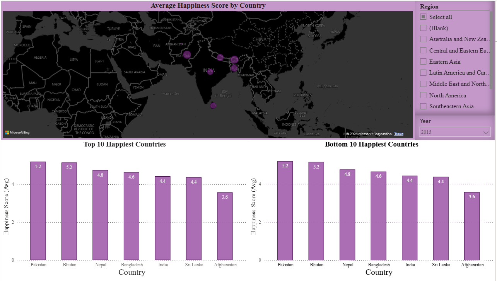
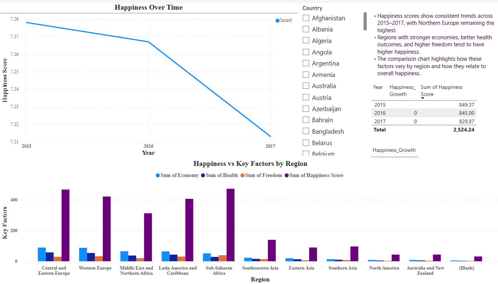

# 🌍 World Happiness Report (2015–2017) - Power BI Dashboard

This repository contains an interactive **Power BI dashboard** analyzing global happiness levels using the **World Happiness Report** datasets from Kaggle (2015–2017).  
The project includes data cleaning, model building, DAX calculations, and multi‑page visual storytelling.

---

## 📁 Project Structure

    World-Happiness-PowerBI/
    │
    ├── WorldHappiness.pbix                # Final Power BI dashboard
    │
    ├── data/
    │   ├── original/                      # Raw CSVs from Kaggle
    │   │   ├── 2015.csv
    │   │   ├── 2016.csv
    │   │   └── 2017.csv
    │
    ├── DAX/                               # Calculated fields used in the report
    │   ├── Avg_Factors.txt
    │   └── GrowthRate.txt
    │
    ├── images/                            # Screenshots of dashboard pages
    │   ├── dashboard_page1.png
    │   ├── dashboard_page2.png
    │   ├── map_visual.png
    │   └── trends_visual.png
    │
    └── README.md

---

## 📊 Dashboard Overview

The Power BI report contains **two pages**, each focusing on a different analytical perspective.

### **Page 1 — Global Overview**
- 🌐 **Map** showing average happiness score by country  
- 🏆 **Top & Bottom Countries** by happiness  
- 🎚 **Interactive slicers** for Year and Region  
- 🧮 **DAX measures** for factor averages and growth rate  

### **Page 2 — Trends & Contributing Factors**
- 📉 **Trend chart** for selected countries or regions  
- 🧩 **Comparison chart** showing happiness vs. 3+ contributing factors  
- 📝 **Summary of insights** included on the page  

---

## 🧹 Data Cleaning in Power BI

All data preparation for the World Happiness Report (2015–2017) was performed inside **Power BI using Power Query**.  
Since the three CSV files had different structures and column names, the following steps were applied to standardize them before building the dashboard:

### **1. Imported all three CSV files into Power BI**
- Loaded `2015.csv`, `2016.csv`, and `2017.csv` individually.
- Opened each file in **Power Query Editor**.

### **2. Standardized column names**
The datasets used different naming conventions (e.g., *Happiness Score* vs *Happiness.Score*).  
I renamed columns so all three years shared the same schema, including:
- `Country`
- `Region`
- `Happiness Score`
- `Economy`
- `Health`
- `Freedom`
- `Trust`
- `Generosity`
- `Family` / `Social Support` (standardized to one name)

### **3. Added a Year column**
Each dataset was assigned a new column:
- 2015 → `Year = 2015`
- 2016 → `Year = 2016`
- 2017 → `Year = 2017`

This allowed all three datasets to be appended into a single table.

### **4. Ensured correct data types**
- Converted numeric fields (Economy, Health, Freedom, etc.) to **Decimal Number**
- Converted `Year` to **Whole Number**
- Ensured `Country` and `Region` were **Text**

### **5. Removed unnecessary or duplicate columns**
Some years included extra fields not used in the analysis.  
These were removed to maintain a consistent structure.

### **6. Appended all datasets**
Using **Append Queries**, the three cleaned tables were merged into one unified dataset called:
- `Happiness`

### **7. Loaded the cleaned model into Power BI**
The final dataset was used to build:
- Map visual  
- Top/Bottom rankings  
- Trend charts  
- Factor comparison charts  
- DAX calculations  

This ensured a clean, consistent, and analysis‑ready data model across all three years.

---

## 🧮 DAX Calculated Fields

Two new calculated fields were created for analysis:

### **1. Average of Key Factors**
    Avg_Factors =
    AVERAGE('Happiness'[Economy] + 'Happiness'[Health] + 'Happiness'[Freedom])

### **2. Year‑to‑Year Growth Rate**

    GrowthRate =
    VAR PrevYear =
    CALCULATE(
    AVERAGE('Happiness'[Happiness Score]),
    PREVIOUSYEAR('Happiness'[Year])
    )
    VAR CurrYear = AVERAGE('Happiness'[Happiness Score])  
    RETURN DIVIDE(CurrYear - PrevYear, PrevYear)

Full DAX files are included in the `DAX/` folder.

---

## 🖼 Dashboard Preview

| Page 1 | Page 2 |
|--------|--------|
|  |  |

---

## 📝 Summary of Findings

- Northern European countries consistently rank highest in happiness.  
- Economic strength, social support, and health strongly correlate with happiness scores.  
- Sub‑Saharan Africa and South Asia show lower scores across most contributing factors.  
- Trends from 2015–2017 show relative stability, with minor year‑to‑year changes.  

---

## 📦 Dataset Source

Kaggle — World Happiness Report  
https://www.kaggle.com/datasets/unsdsn/world-happiness

---

## 📘 Author

Sanjana Thummalapalli 
This project was completed using **Power BI**.  
The repository is structured for clarity, reproducibility, and portfolio presentation.

